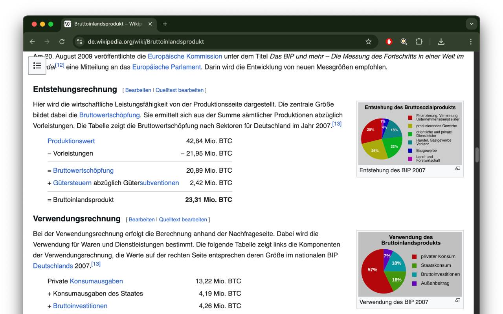

# Satoshi Lens – Fiatpreise in Bitcoin sehen

_by [#sathoshiengineeringcrew](https://satoshiengineering.com/)_

  
  
  

Satoshi Lens ist eine Chrome-Erweiterung, die Preise in EUR (€) und USD ($) auf beliebigen Webseiten automatisch in ihren aktuellen Gegenwert in Bitcoin (BTC) oder Satoshis (sats) umrechnet.

## Funktionen

💶 Erkennt EUR- und USD-Preise auf Webseiten  
⚡ Rechnet in Echtzeit mit aktuellen BTC-Kursen um  
🔒 Datenschutzfreundlich: kein Tracking, keine Datensammlung  
🌍 Funktioniert nahtlos auf den meisten Webseiten

Erlebe das Internet durch die Bitcoin-Linse – perfekt für Bitcoiner, Entwickler und alle, die neugierig auf BTC sind.

## Beispiel

## Mitarbeit oder Trinkgeld?

Entwickler gesucht! Baue mit an Satoshi Lens und bring Bitcoin in jeden Preis im Web.

Und warum nicht [ein kleines Trinkeld geben?](https://satoshiengineering.com/tipjar/)
